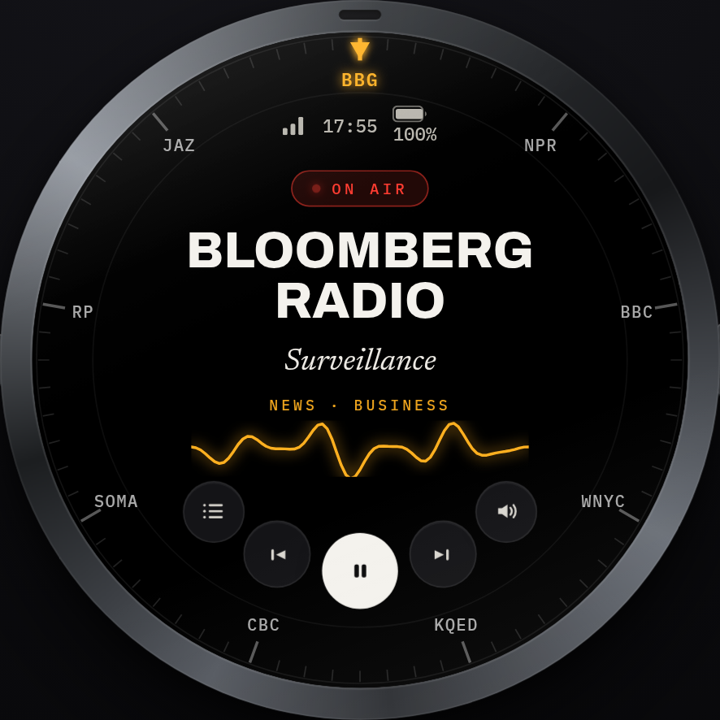
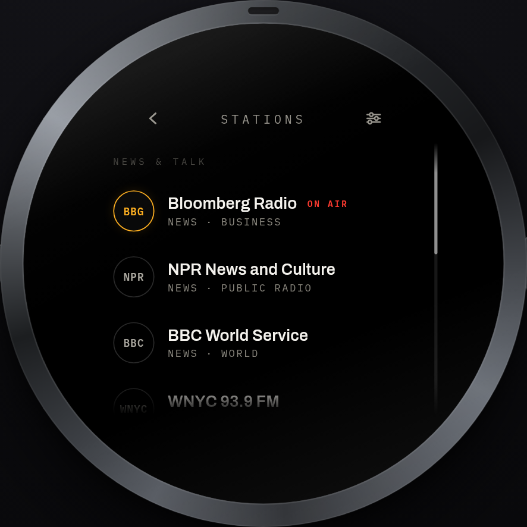
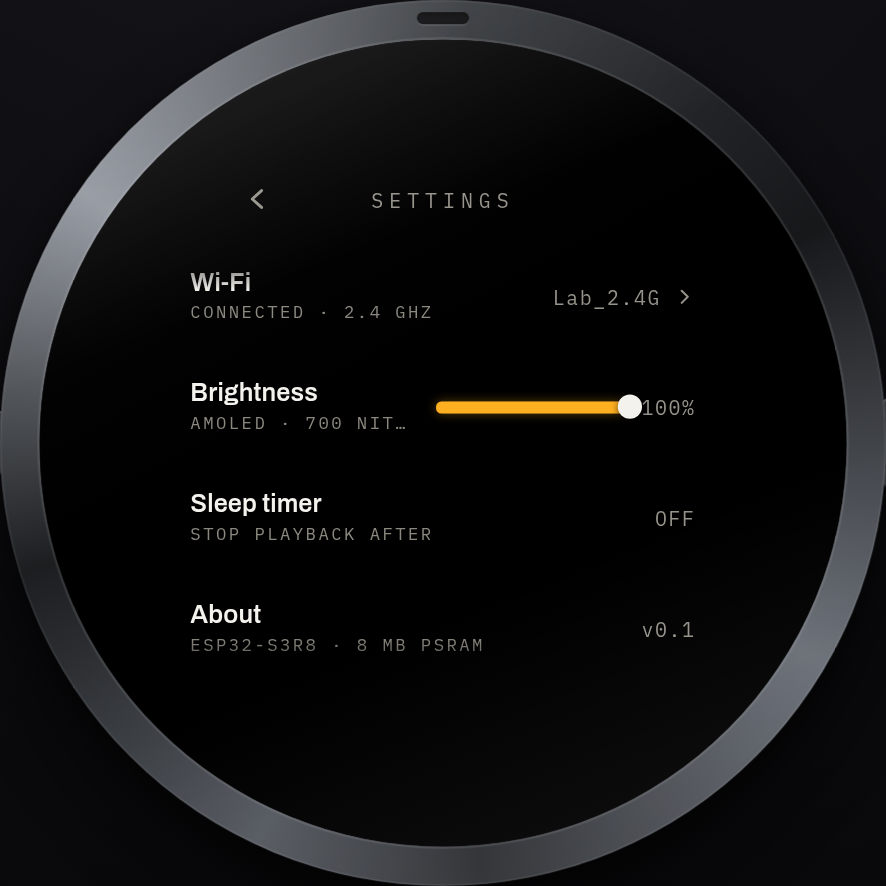
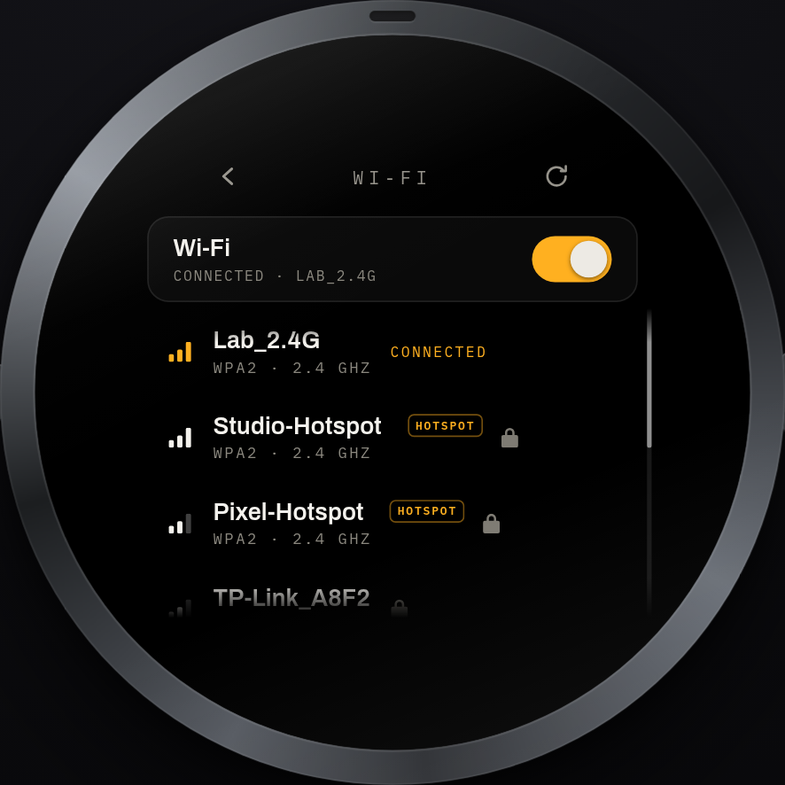
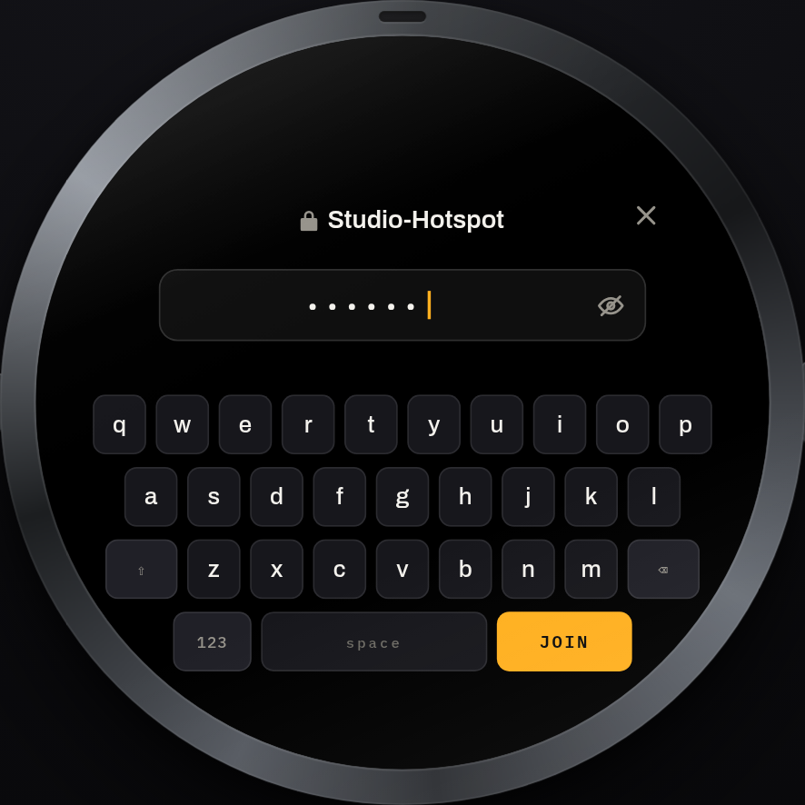
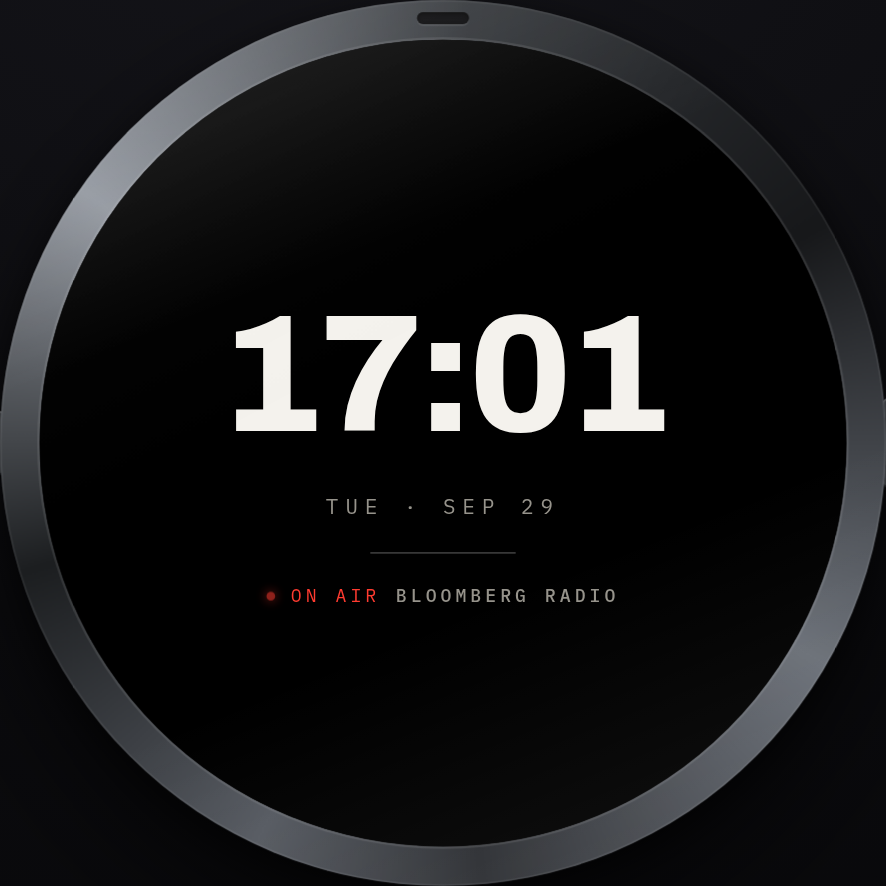

# SIGNAL — Internet Radio

A round-native internet radio for the **Waveshare ESP32-S3-Touch-AMOLED-1.75C**
(466×466 AMOLED, CST9217 touch, ES8311 codec): a high-fidelity browser
prototype used as the pixel-level design source of truth, and the Arduino
firmware that ports it to the device.

```
signal-internet-radio/
├── prototype/004-signal/       # the approved high-fidelity prototype (the design spec)
│   ├── index.html / fonts.css  # self-contained, opens offline via file://
│   └── screenshots/            # 2× reference renders of every screen
├── firmware/ESP32S3_WEB_RADIO/ # the device firmware (Arduino sketch)
└── tools/flash_device.py       # one-command build-output flasher (no BOOT drill)
```

---

## Screens

| | | |
|---|---|---|
|  |  |  |
| Now playing | Stations | Settings |
|  |  |  |
| Wi-Fi | Password + keyboard | Standby |

---

## 1. The product

The status line on the now-playing screen shows **real hardware values**: battery
percentage from the on-board AXP2101 PMIC (XPowersLib, chip-computed %) and Wi-Fi
signal bars from `WiFi.RSSI()` (3 bars >= -55 dBm, 2 >= -70, else 1; dimmed while
the radio is off). With no battery connected to the PMIC the display honestly reads
`--%`.

**Screens** (all inside the 466×466 safe circle):

- **Now playing** — the "watchface": station ring dial with 9 labelled ticks
  (major tick every 40°), purple caret + highlighted label for the current
  station, track/genre info, live waveform, and a 5-button bottom bar
  (prev · volume · stations · more · play).
- **Stations** — logo · name · genre rows with header-clipped scroll list and
  scroll bar; current station gets an ON-AIR/playing badge.
- **Settings** — Wi-Fi (connected badge + network name), Brightness
  (50–100 % slider, drives the CO5300 `WDBRIGHTNESSVALNOR` register), Sleep
  timer, About.
- **Wi-Fi** — one unified page: scan list, per-network password entry with a
  full QWERTY keyboard (123/symbol modes, shift, key press feedback), password
  peek (eye toggle), connect/disconnect/forget.
- **Standby** — clock face; short press on the BOOT button = next station,
  long press = standby toggle.

**Gestures** — drag the dial ring to tune · swipe ↑ stations · swipe ↓
settings · drag the lists to scroll · tap/drag the brightness row.

**Radio** — 9 stations (Bloomberg, NPR, BBC, WNYC, KQED, CBC, SomaFM,
Radio Paradise, Jazz24), auto-seeded to LittleFS on first boot in exactly the
prototype's order/data, last station + volume + brightness persisted in NVS.

---

## 2. Architecture (firmware)

| File | Role |
|---|---|
| `ESP32S3_WEB_RADIO.ino` | boot order, BOOT button, `Serial.setTxTimeoutMs(0)` (non-blocking console) |
| `display.cpp` | CO5300 466×466 QSPI, PSRAM framebuffers, `GFX_SKIP_OUTPUT_BEGIN`, brightness |
| `touch.cpp` | CST9217 @0x2D, 15-byte reads + 0xAB ACK, X/Y mirror, 10 ms poll **task**, edge queue (D/M/U), `E x,y` + `G x1,y1,x2,y2` injection |
| `sig_ui.cpp` | widget painter (icons drawn from the prototype's SVG geometry), fonts, `[perf]`/`[info]` console |
| `sig_paint.cpp` | screen painters: dial (ticks: `a % 40 == 0` majors), stations, settings, volume overlay |
| `sig_flow.cpp` | gesture state machine (dial drag / swipes / list drag / brightness), keyboard dispatch, hit testing |
| `sig_wifi.cpp` | Wi-Fi page painter + keyboard rendering, peek/toggle |
| `audio.cpp` | `StreamPlayer`: ESP32-audioI2S engine, ES8311 bring-up, **per-stream codec re-clock**, reconnect backoff |
| `es8311.c/.h` | vendored ES8311 driver (coefficient table used for per-rate re-clock) |
| `wifi_client.cpp` | unified STA management (scan/join/forget/NVS cred map), `WiFi.setSleep(false)` |
| `station_manager.cpp` | LittleFS station list, **auto-seed on first boot** |
| `config.h` | pins, timeouts, defaults — **no credentials** |

**Data paths:** framebuffers in PSRAM (8 MB); input stream buffer ≈ 640 KB;
touch events flow through a FreeRTOS queue into the UI pump; audio runs on the
library's own loop inside `StreamPlayer::loop()`.

### Audio pipeline (the hard-won part)

- I2S follows **each stream's native rate** (22 050 / 32 000 / 44 100 / 48 000 Hz);
  the ES8311 is **re-clocked per stream** via its coefficient table with
  MCLK = 256·fs (e.g. BBC 22 050 → `fs=22050 MCLK=5644800 OK`, NPR 32 000 →
  `fs=32000 MCLK=8192000 OK`). The library's software resampler was tried and
  **removed** — it made the noise floor worse; a fixed 44.1 kHz output path is
  not used.
- `WiFi.setSleep(false)` in the connect path — modem-sleep DTIM windows caused
  micro-stalls on the 96 kbps stereo NPR stream.
- Console writes are **non-blocking** (`setTxTimeoutMs(0)`): with the default
  250 ms TX timeout, every `printf` stalls the UI/audio loop once no serial
  reader is attached (frozen watchface + silent audio). Debug lines are now
  dropped instead of blocking.

---

## 3. Deploy to a brand-new device

### 3.1 Prerequisites

```bash
# arduino-cli with the ESP32 core (tested: 3.3.11)
arduino-cli config add board_manager.additional_urls \
  https://espressif.github.io/arduino-esp32/package_esp32_index.json
arduino-cli core install esp32:esp32

# libraries (exact versions this project was built against)
arduino-cli lib install "ESP32-audioI2S@4.0.0" \
                        "GFX Library for Arduino@1.6.7" \
                        "ArduinoJson@7.4.3" \
                        "XPowersLib@0.3.3"
```

### 3.2 Build

```bash
FQBN='esp32:esp32:esp32s3:PSRAM=opi,FlashSize=32M,PartitionScheme=huge_app,UploadSpeed=921600,USBMode=default,CDCOnBoot=cdc'
arduino-cli compile --fqbn "$FQBN" firmware/ESP32S3_WEB_RADIO
```

`huge_app` matters: it is the partition scheme whose app slot sits at
`0x10000` (the offset this board boots from with the stock bootloader) and
provides the 896 KB spiffs partition that LittleFS uses for the station list.

### 3.3 Flash

```bash
# find the build output, enter the ROM download mode (no BOOT button needed), write, verify
python3 tools/flash_device.py \
  --bin ~/.cache/arduino/sketches/*/ESP32S3_WEB_RADIO.ino.bin
```

Manual equivalent:

```bash
esptool.py --chip esp32s3 -p /dev/ttyACM0 --before no_reset --after watchdog_reset \
  --baud 921600 write_flash 0x10000 build-output.ino.bin
```

Download-mode entry used by `flash_device.py` (works from the stock firmware
*and* from a running SIGNAL build — the device re-enumerates on the **same**
`/dev/ttyACM0`): drive DTR/RTS with `TIOCM` values `0x04, 0x06, 0x02, 0x00`
at 150 ms intervals, then run esptool with `--before no_reset`. If entry ever
fails on a virgin board, the classic fallback always works: **hold BOOT while
plugging the cable in**.

Linux re-bind if the serial node disappears after flashing:

```bash
echo -n 9-1:1.0 | sudo tee /sys/bus/usb/drivers/cdc_acm/bind
```

### 3.4 First boot

1. Station list is seeded automatically (`no stations file — seeding defaults`).
2. Swipe down → **Settings → Wi-Fi → scan → pick your network → type the
   password** on the on-screen keyboard (eye icon peeks/toggles). Credentials
   are stored in NVS only — nothing is hard-coded in this repository.
3. Back → swipe up → **Stations** → tap a station. Done.

---

## 4. Debug console (USB serial, 115200 baud)

| Command | Effect |
|---|---|
| `P` | one-line state: view / current station / vol / bright / play / wifi |
| `E x,y` | inject a tap at panel coordinates |
| `G x1,y1,x2,y2` | inject a drag (down + 10 moves + up) — tests dial/swipe/scroll/brightness |
| `D` | dump a framebuffer as raw PPM (466×466×3) for pixel inspection |
| `T` / `M` | touch info / mode |
| `X` | crosshair overlay |

Useful traces: `[perf]`, `[info]` (decoder params), `[audio] codec fs=… OK`
(per-stream re-clock), `[buff] free=…` (input-buffer fill), `[key]/[peek]`
(keyboard, symbol+length only), `[tapD]/[tapU]/[act]`.

---

## 5. The prototype

`prototype/004-signal/index.html` is fully self-contained (fonts embedded as
base64 woff2 in `fonts.css`) — open it directly via `file://`, no server
needed. On a plain open it wipes any stale localStorage state and boots to a
clean "now playing" screen; `#fresh` forces the same. The prototype and the
firmware share layout metrics, icon geometry (SVG paths transcribed into
integer drawing code), station data, and gesture thresholds.

---

## 6. Privacy

- No Wi-Fi SSIDs/passwords, tokens, emails, or machine paths are committed.
  `WIFI_SSID`/`WIFI_PASSWORD` in `config.h` are empty placeholders for an
  optional legacy fallback; real credentials enter through the UI and live in
  the device's NVS.
- Station list = public stream URLs only.
